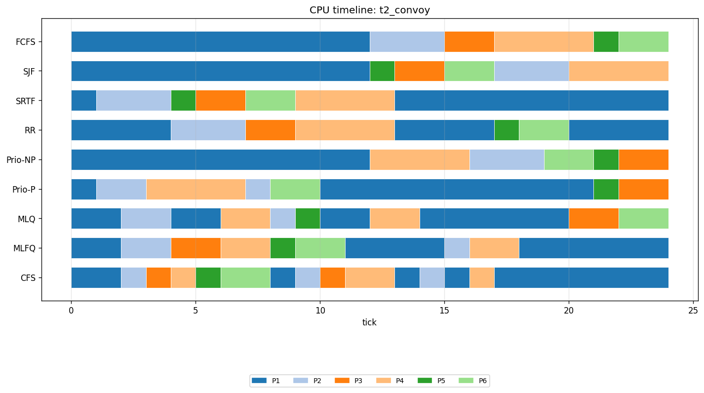

# CPU Scheduler Simulator

A single-core, tick-based CPU scheduler simulator in C99. Nine scheduling algorithms run over the same six workloads, and the output is the metrics, timelines, and charts needed to explain how and why they diverge.

Written to understand scheduling by building it rather than by reading about it.



Every algorithm on the same workload. The top row is FCFS, where one twelve-tick process blocks five short ones behind it. The bottom row is CFS, interleaving everything. Same six processes, same total time, completely different experience for each process.

---

## Build and run

Requires gcc, make, python3, and matplotlib. Developed on WSL2 with Ubuntu 22.04.

```bash
make
```

```bash
./scheduler --algo <name> --trace <file> [--quantum N]
./scheduler --all
./scheduler --sweep --trace <file>
```

Algorithm names: `fcfs`, `sjf`, `srtf`, `rr`, `priority_np`, `priority_p`, `mlq`, `mlfq`, `cfs`.

`--all` runs every algorithm over every trace in `traces/`. `--sweep` runs Round Robin over quanta 1 to 12 and writes only the sweep summary. `--quantum` applies to `rr` only and is an error elsewhere, not a silent no-op.

Charts:

```bash
python3 tools/plot.py
```

Tests:

```bash
./tests/run_tests.sh
```

This diffs live output against 54 hand-verified golden files. All should pass.

---

## The nine algorithms

| Algorithm | Selects by | Preempts | Quantum |
|---|---|---|---|
| FCFS | arrival order | never | none |
| SJF | shortest burst | never | none |
| SRTF | shortest remaining time | every tick | none |
| RR | queue head | on quantum expiry | 4 by default |
| Priority-NP | lowest priority number | never | none |
| Priority-P | lowest priority number | every tick | none |
| MLQ | highest non-empty queue, fixed assignment | on higher-queue arrival | 2 / 4 / none |
| MLFQ | highest non-empty queue, earned level | on higher-queue arrival and boost | 2 / 4 / 8 |
| CFS | lowest virtual runtime | every tick | none |

---

## What the results show

Full writeup with numbers in [`docs/ANALYSIS.md`](docs/ANALYSIS.md). Four findings worth surfacing here.

**There is no best scheduler.** Ranking the nine by average waiting time and by average response time gives two different orders. On `t6_interactive`, SJF has the lowest waiting at 6.87 ticks and CFS is seventh at 13.93, while CFS has the best response at 3.00 and SJF is fourth at 6.87. Which one is better depends entirely on what you are optimising for.

**Averages hide starvation.** On `t3_starvation`, SJF's average waiting is 20.17 against FCFS's 21.17, a negligible improvement. But SJF's worst-off process waits 32 ticks where FCFS's waits 27. The algorithm that provably minimises average waiting time is worse than FCFS for the process it treats worst. Any evaluation reporting only means would miss this entirely.

**Ignoring information is sometimes fairest.** On `t4_priority_skew`, a workload built to punish low-priority processes, FCFS has the lowest max waiting at 9 ticks and the lowest waiting-time spread at 2.65. It achieves that by ignoring the priority field completely. Preemptive priority scheduling gets the best average response at 1.30 ticks and the worst max waiting at 20.

**Responsiveness is bought with context switches.** On `t5_mixed`, CFS makes 82 context switches against FCFS's 19 and returns a response time ten times better. Switches cost zero ticks in this simulator, so that is free here. On real hardware it would not be, which is exactly why real CFS has a minimum granularity floor that this implementation deliberately omits.

---

## Notable implementation details

**One engine, nine schedulers, no branches.** The tick loop in `src/engine.c` calls through a struct of function pointers and contains no algorithm-specific code. Adding a scheduler means writing one file in `src/sched/` and adding one line to the registry.

**The process table is const to schedulers.** They read it to make decisions but cannot write it. `remaining`, `start`, and `completion` belong to the engine. The compiler enforces this, so a scheduler that tries to keep its own copy of the bookkeeping fails to build.

**The tie-break is free.** The loader sorts processes by arrival, then PID. Every selection scan then uses a strict `<`, so on equal keys the earlier-arriving process is already in place and stays there. The global tie-break rule is implemented by doing nothing, in every algorithm.

**Determinism is a requirement, not an accident.** Nothing random, time-based, or address-based touches a scheduling decision, and `qsort` is barred from any ordering where the comparator could return 0. Two runs produce byte-identical files, which is what makes golden-file testing possible.

**CFS has a deliberate flaw.** The vruntime update uses truncating integer division, so any weight above 1024 gives an increment of zero and a negative-nice process never yields the CPU. This is left in because working out why is more instructive than a correct implementation. See [`docs/CFS_NOTES.md`](docs/CFS_NOTES.md).

---

## How correctness was established

**Golden files.** Three of the six traces were worked by hand for six algorithms, giving 54 expected CSV files under `tests/expected/`. `tests/run_tests.sh` diffs live output against them byte for byte.

The hand calculations found three real bugs before any code existed: a misplaced process in the Round Robin ordering on `t2_convoy`, a wrong selection in SJF on `t4_priority_skew`, and a context switch count that had been confused with a preemption count. Fixing those in the spec rather than in the code afterwards is the main argument for writing the spec first.

**Runtime invariants.** Nine properties asserted at the end of every run: executed ticks equal the sum of bursts, nothing runs before it arrives, every process completes, and in MLFQ no process drops a level except on a tick where its quantum reached zero.

**Structural cross-checks.** MLQ, MLFQ, and CFS have no hand calculations, so they were verified by reduction. MLQ with every process in one queue produces a timeline identical to that queue's policy, checked against all three levels. MLFQ on a trace where no burst can exhaust a Q0 slice is identical to Round Robin with quantum 2. Round Robin with a quantum at least as large as the longest burst is identical to FCFS.

Where verification is weaker, the documentation says so rather than implying otherwise.

---

## Repository layout

```
Makefile              C99, gcc, no third-party libraries
src/
  main.c              CLI, orchestration
  process.h/.c        process struct, trace loader, validation
  engine.h/.c         tick loop, timeline, switch counting
  metrics.h/.c        metric formulas, invariant checks
  csv.h/.c            output writers
  sched/
    sched.h           the scheduler interface
    registry.c        name to implementation lookup
    fcfs.c sjf.c srtf.c rr.c priority.c mlq.c mlfq.c cfs.c
traces/               six workloads, six-field text format
tests/
  expected/           54 hand-verified golden CSVs
  run_tests.sh        the diff runner
tools/plot.py         charts, reads CSVs only
docs/
  PROJECT.md          original scope and plan
  SPEC.md             implementation specification
  HAND_CALCULATIONS.md
  ANALYSIS.md         results and interpretation
  CFS_NOTES.md        CFS simplifications and the truncation flaw
output/               generated CSVs (gitignored) and charts
```

---

## Trace format

One process per line, six whitespace-separated integers. Lines beginning with `#` are comments.

```
# pid  arrival  burst  priority  nice  queue
  1    0        6      3         0     0
  2    0        2      1         0     0
```

Priority runs 0 to 9 where lower is more urgent. Nice runs -5 to +5 and is used only by CFS. Queue runs 0 to 2 and is used only by MLQ. All six fields are always present so that one trace file works for all nine algorithms.

The loader rejects a file with the wrong field count, an out-of-range value, a duplicate PID, or no processes, naming the offending line.

---

## Documentation

- [`docs/SPEC.md`](docs/SPEC.md) is the implementation contract: every rule, constant, formula, and output format, plus eighteen ambiguities resolved before any code was written.
- [`docs/ANALYSIS.md`](docs/ANALYSIS.md) is the results writeup, with every figure traceable to a generated CSV.
- [`docs/CFS_NOTES.md`](docs/CFS_NOTES.md) covers what this CFS leaves out, why the truncating division breaks it, how real Linux avoids that, and what EEVDF changed in 6.6.
- [`docs/HAND_CALCULATIONS.md`](docs/HAND_CALCULATIONS.md) is the pen-and-paper working the golden files come from.
